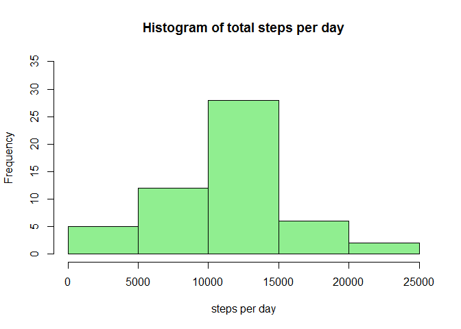
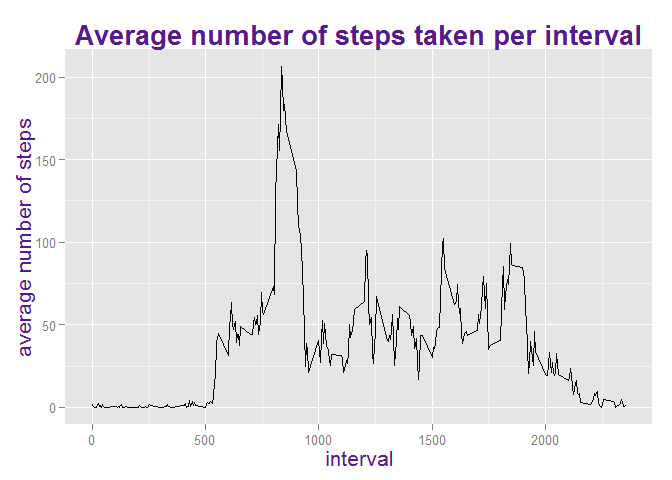
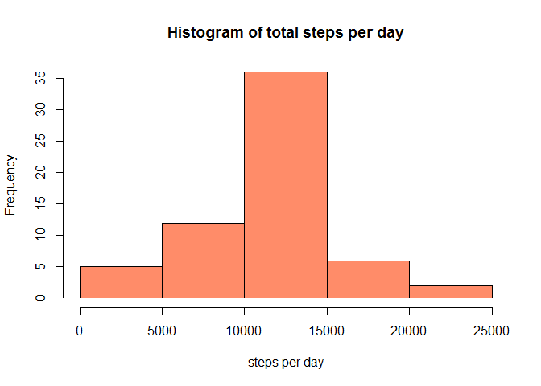
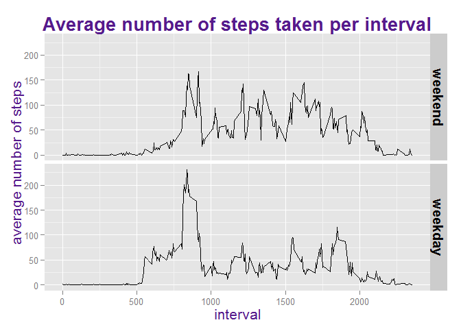

# Activity Monitoring
Eliza da Silva Gomes  
15 de julho de 2015  

# Introduction

This assignment makes use of data from a personal activity monitoring device, which collects data at 5 minute intervals through out the day. The data contains the number of steps taken in 5 minute intervals for each of the days of October and November, 2012. 

# Data

The data can be downloaded from the course web site:

Dataset: Activity monitoring data [52K]
The variables included in this dataset are:

- steps: Number of steps taken in a 5-minute interval (missing values are coded as NA)

- date: The date on which the measurement was taken in YYYY-MM-DD format

- interval: Identifier for the 5-minute interval in which measurement was taken

The dataset is stored in a comma-separated-value (CSV) file and there are a total of 17,568 observations in this dataset.

# Assignment

We are going to manipulate the data in order to answer some questions and fullfil some requirements. 

<br/>

### Loading and preprocessing the data    
##### **1. Load the data**
We will set echo=TRUE as a global option so that the R code is always shown. 

```r
data <- read.csv("activity.csv", colClasses = c("numeric", "Date", "numeric"))
```

##### **2. Process/transform the data (if necessary) into a format suitable for your analysis**

```r
library(plyr); library(dplyr)
```

<br/>

### What is mean total number of steps taken per day?
For this part of the assignment, we will ignore the missing values in the dataset.

##### **1.	Calculate the total number of steps taken per day.**

```r
data_per_day <- group_by(data, date)
steps_per_day <- summarize(data_per_day, total_steps_per_day = sum(steps))
```

##### **2. Make a histogram of the total number of steps taken each day.**

```r
hist(steps_per_day$total_steps_per_day, col = "lightgreen", ylim = c(0,35), xlab = "steps per day", main=paste("Histogram of total steps per day"))
```

 

##### **3. Calculate and report the mean and median of the total number of steps taken per day.**

```r
mean_steps_per_day <- mean(steps_per_day$total_steps_per_day, na.rm = T)
median_steps_per_day <- median(steps_per_day$total_steps_per_day, na.rm = T)
values <- as.data.frame(cbind(mean_steps_per_day, median_steps_per_day))
colnames(values) <- c("mean", "median")
values
```

```
##       mean median
## 1 10766.19  10765
```

<br/>

### What is the average daily activity pattern?

##### **1. Make a time series plot (i.e. type = "l") of the 5-minute interval (x-axis) and the average number of steps taken, averaged across all days (y-axis).**

```r
library(ggplot2)
data_per_interval <- group_by(data, interval)

average_steps_by_interval <- summarise(data_per_interval, average_number_of_steps = mean(steps, na.rm = T))

g <- ggplot(average_steps_by_interval, aes(x = interval, y = average_number_of_steps), main= )
g + geom_line() + scale_y_continuous("average number of steps") + ggtitle("Average number of steps taken per interval") +  theme(plot.title = element_text(face="bold", size=20, colour = "purple4"), axis.title  = element_text( vjust=0.5, size=16,colour = "purple4"))
```

 

##### **2. Which 5-minute interval, on average across all the days in the dataset, contains the maximum number of steps?**

```r
maximum_number_of_steps <- max(average_steps_by_interval$average_number_of_steps)
filter(average_steps_by_interval, average_number_of_steps == maximum_number_of_steps)[,1]
```

```
## Source: local data frame [1 x 1]
## 
##   interval
## 1      835
```

<br/>

### Imputing missing values

##### **1. Calculate and report the total number of missing values in the dataset (i.e. the total number of rows withNAs).**

```r
sum(is.na(data$steps))
```

```
## [1] 2304
```

##### **2. Devise a strategy for filling in all of the missing values in the dataset.** 
The presence of missing days may introduce bias into some calculations or summaries of the data. Therefore, we will fill in the missing values with the mean for that 5-minute interval. 

```r
library(devtools); library(data.table)
devtools::source_gist("4959237")
data_no_na <- FillIn(D1 = data, D2 = average_steps_by_interval, Var1 = "steps", 
       Var2 = "average_number_of_steps", KeyVar = "interval")
```

```
## [1] "2304 NAs were replaced."
## [1] "The correlation between steps and average_number_of_steps is 0.366 based on 17568 shared observations."
```

##### **3. Create a new dataset that is equal to the original dataset but with the missing data filled in.**

```r
data_no_na <- arrange(data_no_na, date, interval)
head(data_no_na)
```

```
##   interval     steps       date
## 1        0 1.7169811 2012-10-01
## 2        5 0.3396226 2012-10-01
## 3       10 0.1320755 2012-10-01
## 4       15 0.1509434 2012-10-01
## 5       20 0.0754717 2012-10-01
## 6       25 2.0943396 2012-10-01
```

##### **4. Make a histogram of the total number of steps taken each day and calculate and report the mean and median total number of steps taken per day.** 

```r
steps_per_day_no_na <- summarise(group_by(data_no_na, date), total_steps_per_day = sum(steps))
hist(steps_per_day_no_na$total_steps_per_day, col = "salmon1", main=paste("Histogram of total steps per day"), xlab = "steps per day")
```

 

```r
mean_steps_per_day_no_na <- mean(steps_per_day_no_na$total_steps_per_day)
median_steps_per_day_no_na <- median(steps_per_day_no_na$total_steps_per_day, na.rm = T)

values <- as.data.frame(cbind(mean_steps_per_day_no_na, median_steps_per_day_no_na))
colnames(values) <- c("mean", "median")
values
```

```
##       mean   median
## 1 10766.19 10766.19
```
**Do these values differ from the estimates from the first part of the assignment? What is the impact of imputing missing data on the estimates of the total daily number of steps?**  
The mean doesn't differ from the one with the missing values ignored, since we filled in the NA's with the mean for the 5-minute interval. The median slightly differ from the estimates from the first part of the assignment; it becomes equal to the mean. The impact is really small. 

<br/>

### Are there differences in activity patterns between weekdays and weekends?     
For this part, we will use the dataset with the filled-in missing values for this part.

##### **1. Create a new factor variable in the dataset with two levels - "weekday" and "weekend" indicating whether a given date is a weekday or weekend day.**

```r
Sys.setlocale("LC_TIME", "English")
```

```
## [1] "English_United States.1252"
```

```r
weekdaysvec <- c('Monday', 'Tuesday', 'Wednesday', 'Thursday', 'Friday')
data_no_na$day <- factor((weekdays(data_no_na$date) %in% weekdaysvec), 
                   levels=c(FALSE, TRUE), labels=c('weekend', 'weekday')) 
head(data_no_na)
```

```
##   interval     steps       date     day
## 1        0 1.7169811 2012-10-01 weekday
## 2        5 0.3396226 2012-10-01 weekday
## 3       10 0.1320755 2012-10-01 weekday
## 4       15 0.1509434 2012-10-01 weekday
## 5       20 0.0754717 2012-10-01 weekday
## 6       25 2.0943396 2012-10-01 weekday
```

##### **2. Make a panel plot containing a time series plot (i.e. type = "l") of the 5-minute interval (x-axis) and the average number of steps taken, averaged across all weekday days or weekend days (y-axis).**

```r
data_no_na_per_interval <- group_by(data_no_na, day, interval)
average_steps_by_interval_no_na <- summarise(data_no_na_per_interval,
                                             average_number_of_steps = mean(steps))

qplot(interval, average_number_of_steps, data = average_steps_by_interval_no_na, 
      facets = day ~ ., binwidth = 2, geom="line",
      ylab="average number of steps", main="Average number of steps taken per interval") + theme(plot.title=element_text(size=20, face="bold", colour = "purple4"), axis.title  = element_text( vjust=0.5, size=16, colour = "purple4"), strip.text.y = element_text(size=15, face="bold"))
```

 

As shown by the panel plot, there is more activity in the weekdays mornings, which can be explained by the fact that people go to work and school by this time. On the weekends, the distribution of the number of steps is flatter through out the day and the activity starts later in the morning (people tend to wake up later).   


